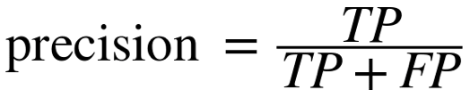
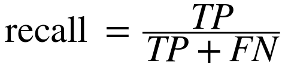
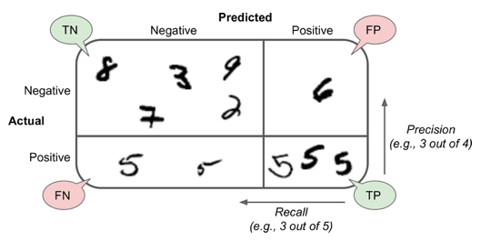

# Index

1. [The Machine Learning Landscape](#the-machine-learning-landscape)
11. [Training Deep Neural Nets](#training-deep-neural-nets)
12. [Distributing TensorFlow Across Devices and Servers](#distributing-tensorflow-across-devices-and-servers)
13. [Convolutional Neural Networks](#convolutional-neural-networks)

## The Machine Learning Landscape

### 1. How would you define Machine Learning?
Machine Learning is about building systems that can learn from data. Learning means getting better at some task, given some performance measure.

### 2. Can you name four types of problems where it shines?
Machine Learning is great for complex problems for which we have no algorithmic solution, to replace long lists of hand-tuned rules, to build systems that adapt to fluctuating environments, and finally to help humans learn (e.g., data mining).

### 3. What is a labeled training set?
A labeled training set is a training set that contains the desired solution (a.k.a. a label) for each instance.

### 4. What are the two most common supervised tasks?
The two most common supervised tasks are regression and classification.

### 5. Can you name four common unsupervised tasks?
Common unsupervised tasks include clustering, visualization, dimensionality reduction, and association rule learning.

### 6. What type of Machine Learning algorithm would you use to allow a robot to walk in various unknown terrains?
Reinforcement Learning is likely to perform best if we want a robot to learn to walk in various unknown terrains since this is typically the type of problem that Reinforcement Learning tackles. It might be possible to express the problem as a supervised or semisupervised learning problem, but it would be less natural.

### 7. What type of algorithm would you use to segment your customers into multiple groups?
If you don’t know how to define the groups, then you can use a clustering algorithm (unsupervised learning) to segment your customers into clusters of similar customers. However, if you know what groups you would like to have, then you can feed many examples of each group to a classification algorithm (supervised learning), and it will classify all your customers into these groups.

### 8. Would you frame the problem of spam detection as a supervised learning problem or an unsupervised learning problem?
Spam detection is a typical supervised learning problem: the algorithm is fed many emails along with their label (spam or not spam).

### 9. What is an online learning system?
An online learning system can learn incrementally, as opposed to a batch learning system. This makes it capable of adapting rapidly to both changing data and autonomous systems, and of training on very large quantities of data.

### 10. What is out-of-core learning?
Out-of-core algorithms can handle vast quantities of data that cannot fit in a computer’s main memory. An out-of-core learning algorithm chops the data into mini-batches and uses online learning techniques to learn from these mini-batches.

### 11. What type of learning algorithm relies on a similarity measure to make predictions?
An instance-based learning system learns the training data by heart; then, when given a new instance, it uses a similarity measure to find the most similar learned instances and uses them to make predictions.

### 12. What is the difference between a model parameter and a learning algorithm’s hyperparameter?
A model has one or more model parameters that determine what it will predict given a new instance (e.g., the slope of a linear model). A learning algorithm tries to find optimal values for these parameters such that the model generalizes well to new instances. A hyperparameter is a parameter of the learning algorithm itself, not of the model (e.g., the amount of regularization to apply).

### 13. What do model-based learning algorithms search for? What is the most common strategy they use to succeed? How do they make predictions?
A model has one or more model parameters that determine what it will predict given a new instance (e.g., the slope of a linear model). A learning algorithm tries to find optimal values for these parameters such that the model generalizes well to new instances. A hyperparameter is a parameter of the learning algorithm itself, not of the model (e.g., the amount of regularization to apply).

### 14. Can you name four of the main challenges in Machine Learning?
Some of the main challenges in Machine Learning are the lack of data, poor data quality, nonrepresentative data, uninformative features, excessively simple models that underfit the training data, and excessively complex models that overfit the data.

### 15. If your model performs great on the training data but generalizes poorly to new instances, what is happening? Can you name three possible solutions?
If a model performs great on the training data but generalizes poorly to new instances, the model is likely overfitting the training data (or we got extremely lucky on the training data). Possible solutions to overfitting are getting more data, simplifying the model (selecting a simpler algorithm, reducing the number of parameters or features used, or regularizing the model), or reducing the noise in the training data.

### 16. What is a test set and why would you want to use it?
A test set is used to estimate the generalization error that a model will make on new instances, before the model is launched in production.

### 17. What is the purpose of a validation set?
A validation set is used to compare models. It makes it possible to select the best model and tune the hyperparameters.

### 18. What can go wrong if you tune hyperparameters using the test set?
If you tune hyperparameters using the test set, you risk overfitting the test set, and the generalization error you measure will be optimistic (you may launch a model that performs worse than you expect).

### 19. What is cross-validation and why would you prefer it to a validation set?
Cross-validation is a technique that makes it possible to compare models (for model selection and hyperparameter tuning) without the need for a separate validation set. This saves precious training data.

### *Confusion Matrix*

- *Precision* - is the accuracy of the positive predictions; this is called the precision of the classifier.
- *Recall* - also called sensitivity or true positive rate (**TPR**): this is the ratio of positive instances that are correctly detected by the classifier.

## Training Deep Neural Nets

### 1. Is it okay to initialize all the weights to the same value as long as that value is selected randomly using He initialization?
No, all weights should be sampled independently; they should not all have the same initial value. One important goal of sampling weights randomly is to break symmetries: if all the weights have the same initial value, even if that value is not zero, then symmetry is not broken (i.e., all neurons in a given layer are equivalent), and backpropagation will be unable to break it. Concretely, this means that all the neurons in any given layer will always have the same weights. It’s like having just one neuron per layer, and much slower. It is virtually impossible for such a configuration to converge to a good solution.

### 2. Is it okay to initialize the bias terms to 0?
It is perfectly fine to initialize the bias terms to zero. Some people like to initialize them just like weights, and that’s okay too; it does not make much difference.

### 3. Name three advantages of the ELU activation function over ReLU.
A few advantages of the ELU function over the ReLU function are:
- It can take on negative values, so the average output of the neurons in any given layer is typically closer to 0 than when using the ReLU activation function (which never outputs negative values). This helps alleviate the vanishing gradients problem.
- It always has a nonzero derivative, which avoids the dying units issue that can affect ReLU units.
- It is smooth everywhere, whereas the ReLU’s slope abruptly jumps from 0 to 1 at z = 0. Such an abrupt change can slow down Gradient Descent because it will bounce around z = 0.

### 4. In which cases would you want to use each of the following activation functions: ELU, leaky ReLU (and its variants), ReLU, tanh, logistic, and softmax?
The ELU activation function is a good default. If you need the neural network to be as fast as possible, you can use one of the leaky ReLU variants instead (e.g., a simple leaky ReLU using the default hyperparameter value). The simplicity of the ReLU activation function makes it many people’s preferred option, despite the fact that they are generally outperformed by the ELU and leaky ReLU. However, the ReLU activation function’s capability of outputting precisely zero can be useful in some cases. The hyperbolic tangent (tanh) can be useful in the output layer if you need to output a number between –1 and 1, but nowadays it is not used much in hidden layers. The logistic activation function is also useful in the output layer when you need to estimate a probability (e.g., for binary classification), but it is also rarely used in hidden layers (there are exceptions — for example, for the coding layer of variational autoencoders). Finally, the softmax activation function is useful in the output layer to output probabilities for mutually exclusive classes, but other than that it is rarely (if ever) used in hidden layers.

### 5. What may happen if you set the `momentum` hyperparameter too close to 1 (e.g., 0.99999) when using a `MomentumOptimizer`?
If you set the `momentum` hyperparameter too close to 1 (e.g., 0.99999) when using a `MomentumOptimizer`, then the algorithm will likely pick up a lot of speed, hopefully roughly toward the global minimum, but then it will shoot right past the minimum, due to its momentum. Then it will slow down and come back, accelerate again, overshoot again, and so on. It may oscillate this way many times before converging, so overall it will take much longer to converge than with a smaller `momentum` value.

### 6. Name three ways you can produce a sparse model.
One way to produce a sparse model (i.e., with most weights equal to zero) is to train the model normally, then zero out tiny weights. For more sparsity, you can apply **ℓ1** regularization during training, which pushes the optimizer toward sparsity. A third option is to combine **ℓ1** regularization with *dual averaging*, using TensorFlow’s `FTRLOptimizer` class.

### 7. Does dropout slow down training? Does it slow down inference (i.e., making predictions on new instances)?
Yes, dropout does slow down training, in general roughly by a factor of two. However, it has no impact on inference since it is only turned on during training.

## Distributing TensorFlow Across Devices and Servers

### 1. If you get a `CUDA_ERROR_OUT_OF_MEMORY` when starting your TensorFlow program, what is probably going on? What can you do about it?

When a TensorFlow process starts, it grabs all the available memory on all GPU devices that are visible to it, so if you get a `CUDA_ERROR_OUT_OF_MEMORY` when starting your TensorFlow program, it probably means that other processes are running that have already grabbed all the memory on at least one visible GPU device (most likely it is another TensorFlow process). To fix this problem, a trivial solution is to stop the other processes and try again. However, if you need all processes to run simultaneously, a simple option is to dedicate different devices to each process, by setting the `CUDA_VISIBLE_DEVICES` environment variable appropriately for each device. Another option is to configure TensorFlow to grab only part of the GPU memory, instead of all of it, by creating a `ConfigProto`, setting its `gpu_options.per_process_gpu_memory_fraction` to the proportion of the total memory that it should grab (e.g., 0.4), and using this `ConfigProto` when opening a session. The last option is to tell TensorFlow to grab memory only when it needs it by setting the `gpu_options.allow_growth` to `True`. However, this last option is usually not recommended because any memory that TensorFlow grabs is never released, and it is harder to guarantee a repeatable behavior (there may be race conditions depending on which processes start first, how much memory they need during training, and so on).

### 2. What is the difference between pinning an operation on a device and placing an operation on a device?

By pinning an operation on a device, you are telling TensorFlow that this is where you would like this operation to be placed. However, some constraints may prevent TensorFlow from honoring your request. For example, the operation may have no implementation (called a *kernel*) for that particular type of device. In this case, TensorFlow will raise an exception by default, but you can configure it to fall back to the CPU instead (this is called *soft placement*). Another example is an operation that can modify a variable; this operation and the variable need to be collocated.
So the difference between pinning an operation and placing an operation is that pinning is what you ask TensorFlow (“ Please place this operation on GPU #1”) while placement is what TensorFlow actually ends up doing (“ Sorry, falling back to the CPU”).

### 3. If you are running on a GPU-enabled TensorFlow installation, and you just use the default placement, will all operations be placed on the first GPU?

If you are running on a GPU-enabled TensorFlow installation, and you just use the default placement, then if all operations have a GPU kernel (i.e., a GPU implementation), yes, they will all be placed on the first GPU. However, if one or more operations do not have a GPU kernel, then by default TensorFlow will raise an exception. If you configure TensorFlow to fall back to the CPU instead (soft placement), then all operations will be placed on the first GPU except the ones without a GPU kernel and all the operations that must be collocated with them.

### 4. If you pin a variable to "`/gpu:0`", can it be used by operations placed on `/gpu:1`? Or by operations placed on "`/cpu:0`"? Or by operations pinned to devices located on other servers?

Yes, if you pin a variable to `/gpu:0`, it can be used by operations placed on `/gpu:1`.
TensorFlow will automatically take care of adding the appropriate operations to transfer the variable’s value across devices.
The same goes for devices located on different servers (as long as they are part of the same cluster).

### 5. Can two operations placed on the same device run in parallel?

Yes, two operations placed on the same device can run in parallel: TensorFlow automatically takes care of running operations in parallel (on different CPU cores or different GPU threads), as long as no operation depends on another operation’s output. Moreover, you can start multiple sessions in parallel threads (or processes), and evaluate operations in each thread. Since sessions are independent, TensorFlow will be able to evaluate any operation from one session in parallel with any operation from another session.

### 6. What is a control dependency and when would you want to use one?

Control dependencies are used when you want to postpone the evaluation of an operation X until after some other operations are run, even though these operations are not required to compute X. This is useful in particular when X would occupy a lot of memory and you only need it later in the computation graph, or if X uses up a lot of I/O (for example, it requires a large variable value located on a different device or server) and you don’t want it to run at the same time as other I/O-hungry operations, to avoid saturating the bandwidth.

### 7. Suppose you train a DNN for days on a TensorFlow cluster, and immediately after your training program ends you realize that you forgot to save the model using a `Saver`. Is your trained model lost?

You’re in luck! In distributed TensorFlow, the variable values live in containers managed by the cluster, so even if you close the session and exit the client program, the model parameters are still alive and well on the cluster. You simply need to open a new session to the cluster and save the model (make sure you don’t call the variable initializers or restore a previous model, as this would destroy your precious new model!).

## Convolutional Neural Networks

### 1. What are the advantages of a CNN over a fully connected DNN for image classification?

These are the main advantages of a CNN over a fully connected DNN for image classification:
- Because consecutive layers are only partially connected and because it heavily reuses its weights, a CNN has many fewer parameters than a fully connected DNN, which makes it much faster to train, reduces the risk of overfitting, and requires much less training data. 
- When a CNN has learned a kernel that can detect a particular feature, it can detect that feature anywhere on the image. In contrast, when a DNN learns a feature in one location, it can detect it only in that particular location. Since images typically have very repetitive features, CNNs are able to generalize much better than DNNs for image processing tasks such as classification, using fewer training examples.
- Finally, a DNN has no prior knowledge of how pixels are organized; it does not know that nearby pixels are close. A CNN’s architecture embeds this prior knowledge. Lower layers typically identify features in small areas of the images, while higher layers combine the lower-level features into larger features. This works well with most natural images, giving CNNs a decisive head start compared to DNNs.

### 2. Consider a CNN composed of three convolutional layers, each with 3 × 3 kernels, a stride of 2, and SAME padding. The lowest layer outputs 100 feature maps, the middle one outputs 200, and the top one outputs 400. The input images are RGB images of 200 × 300 pixels. What is the total number of parameters in the CNN? If we are using 32-bit floats, at least how much RAM will this network require when making a prediction for a single instance? What about when training on a mini-batch of 50 images?

500.0 + 34.3 + 3.4 = 537.7 MB.

### 3. If your GPU runs out of memory while training a CNN, what are five things you could try to solve the problem?

If your GPU runs out of memory while training a CNN, here are five things you could try to solve the problem (other than purchasing a GPU with more RAM):
- Reduce the mini-batch size.
- Reduce dimensionality using a larger stride in one or more layers.
- Remove one or more layers.
- Use 16-bit floats instead of 32-bit floats.
- Distribute the CNN across multiple devices.

### 4. Why would you want to add a max pooling layer rather than a convolutional layer with the same stride?

A max pooling layer has no parameters at all, whereas a convolutional layer has quite a few (see the previous questions).

### 5. When would you want to add a *local response normalization layer*?

A *local response normalization layer* makes the neurons that most strongly activate inhibit neurons at the same location but in neighboring feature maps, which encourages different feature maps to specialize and pushes them apart, forcing them to explore a wider range of features. It is typically used in the lower layers to have a larger pool of low-level features that the upper layers can build upon.

### 6. Can you name the main innovations in AlexNet, compared to LeNet-5? What about the main innovations in GoogLeNet and ResNet?

The main innovations in AlexNet compared to LeNet-5 are (1) it is much larger and deeper, and (2) it stacks convolutional layers directly on top of each other, instead of stacking a pooling layer on top of each convolutional layer. The main innovation in GoogLeNet is the introduction of inception modules, which make it possible to have a much deeper net than previous CNN architectures, with fewer parameters. Finally, ResNet’s main innovation is the introduction of skip connections, which make it possible to go well beyond 100 layers. Arguably, its simplicity and consistency are also rather innovative.

*Géron, Aurélien. Hands-On Machine Learning with Scikit-Learn and TensorFlow: Concepts, Tools, and Techniques to Build Intelligent Systems . O'Reilly Media. Kindle Edition.*
